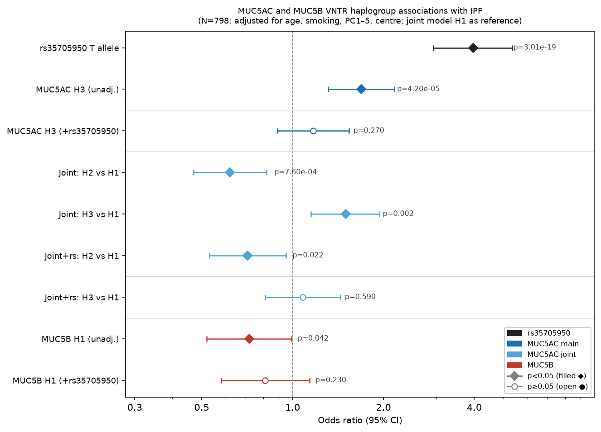

# MUC5AC and MUC5B VNTR haplogroups are not separable from the promoter variant rs35705950 in idiopathic pulmonary fibrosis using array-based data: a tagging-SNP analysis of the IPF Job Exposures Study

**Authors:** Carl Reynolds¹²

**Affiliations:**
¹ Homerton University Hospital NHS Foundation Trust, London, England, UK
² Wolfson Institute of Population Health, Queen Mary University of London, London, England, UK

**Corresponding author:** Carl Reynolds, Homerton University Hospital NHS Foundation Trust, Homerton Row, London E9 6SR, UK. academic@carlreynolds.net

**Keywords:** idiopathic pulmonary fibrosis, MUC5AC, MUC5B, VNTR, haplogroup, gene-environment interaction, asbestos

**Take-home message (optional, for ERJ Open Research):** In a dedicated IPF case–control study, MUC5AC and MUC5B VNTR haplogroup associations with IPF were not separable from the *MUC5B* promoter variant rs35705950 using array-based tagging SNPs; long-read sequencing is required to determine whether VNTR structure confers independent risk.

---

## Abstract

**Background:** A common *MUC5B* promoter variant (rs35705950) is the strongest common genetic risk factor for idiopathic pulmonary fibrosis (IPF). The adjacent mucin genes *MUC5B* and *MUC5AC* contain variable number tandem repeat (VNTR) regions, resolved by long-read sequencing into haplogroups that could influence airway mucus independently of rs35705950. Because these loci are in linkage disequilibrium, haplogroup-tagging SNPs are correlated with rs35705950, and whether an independent effect is resolvable with array data is unclear.

**Methods:** Using tagging SNPs from Plender et al. (2024), we assigned MUC5AC (H1/H2/H3) and MUC5B (H1/H2) VNTR haplogroups from imputed chromosome 11 data in 829 IPF Job Exposures Study (IPFJES) participants (428 cases, 401 controls). Logistic regression (N=798, one cases-only centre excluded) adjusted for age, smoking, five principal components, and centre, before and after rs35705950.

**Results:** MUC5AC H3 and MUC5B H1 were each associated with IPF (H3 OR 1.69; MUC5B H1 OR 0.72), but both tracked the rs35705950 T allele (H3 positively, r=0.34; MUC5B H1 inversely, r=−0.10) and attenuated to non-significance after adjustment (H3 OR 1.17, 95% CI 0.89–1.54, p=0.27; MUC5B H1 OR 0.81, 95% CI 0.58–1.14, p=0.23). MUC5AC H3 and rs35705950 genotypes were discordant in 265/829 participants (32%; cases 138/428, controls 127/401), the subset for long-read resolution.

**Conclusions:** In a dedicated IPF cohort, VNTR-tagging haplogroup associations were not separable from rs35705950, as expected for proxies co-inherited with the promoter variant, so we could neither confirm nor exclude an independent VNTR effect. Resolving this requires long-read sequencing of the discordant subset, not further array-based analysis.

---

## Introduction

Idiopathic pulmonary fibrosis (IPF) is a progressive and frequently fatal fibrotic lung disease (Raghu et al., 2022). The strongest common genetic risk factor is a gain-of-function promoter variant in the mucin gene *MUC5B* (rs35705950; minor allele frequency ~9% in Europeans). The minor (T) allele confers an odds ratio of approximately 4 per allele for IPF (Seibold et al., 2011; Allen et al., 2017) and is estimated to account for nearly half the genetic predisposition to IPF (Fotook Kiaei and Schwartz, 2025). It increases *MUC5B* expression in the bronchiolar epithelium and is thought to predispose to fibrosis through mucociliary dysfunction (Seibold et al., 2011; Hancock et al., 2018).

Both *MUC5B* and *MUC5AC* lie within the 11p15.5 mucin gene cluster and encode gel-forming mucins with large central VNTR regions whose repeat count and sequence vary between individuals. Plender et al. recently used long-read sequencing to characterise the VNTR structure at both loci, defining three MUC5AC haplogroups (H1: short, H2: medium, H3: long) and two MUC5B haplogroups (H1: rare, H2: common), and identifying tagging SNPs (tSNPs) for haplogroup assignment in short-read datasets (Plender et al., 2024).

There are biological grounds to ask whether VNTR haplogroup matters for IPF beyond rs35705950. The VNTR encodes the glycosylated backbone of the mucin polymer (its serine and threonine repeats carry the O-glycans that determine the viscoelastic properties of airway mucus), and MUC5AC and MUC5B are the principal secreted determinants of those properties and of mucociliary clearance (Plender et al., 2024; Hill et al., 2022; Abrami et al., 2024). Variation in VNTR structure could therefore act on that clearance mechanism, the route proposed to link rs35705950 to IPF (Seibold et al., 2011; Hancock et al., 2018), through protein architecture rather than expression level. MUC5B is, moreover, the dominant secretory mucin in the distal airway epithelium most implicated in IPF pathogenesis (Okuda et al., 2019; Fotook Kiaei and Schwartz, 2025). Whether VNTR haplogroup influences IPF risk has nonetheless not been examined in a dedicated case-control study: in the *All of Us* phenome-wide scan, no MUC5AC haplogroup tag survived correction for any phenotype, and the MUC5B locus was represented there by the promoter variant rs35705950 rather than by a VNTR-haplogroup tag (Plender et al., 2024).

A central difficulty, however, is that *MUC5AC*, *MUC5B*, and rs35705950 all lie within the same ~100 kb region of linkage disequilibrium at 11p15.5, so haplogroup-tagging SNPs are correlated with rs35705950; because these SNPs only tag the VNTR rather than measure it, a tagging-based test cannot attribute an independent effect to the VNTR itself, an identifiability limit that no array sample size resolves. A recent whole-genome tandem-repeat GWAS found the 11p15.5 mucin repeat lost genome-wide significance after conditioning on rs35705950, but analysed it as a single repeat, without resolving the MUC5AC and MUC5B haplogroups or testing gene-environment interaction (Oketch et al., 2025). IPFJES, a UK case-control study designed for gene-environment analysis of IPF that previously demonstrated a smoking × asbestos × rs35705950 interaction in disease risk (Reynolds et al., 2023), provides a dedicated setting in which to confront it directly. Here we quantify how much of the apparent MUC5AC and MUC5B haplogroup association with IPF is attributable to rs35705950, test whether any haplogroup signal is separable from it, and identify the participants whose haplogroup and rs35705950 genotypes are discordant: those in whom long-read sequencing could resolve an independent VNTR effect.

---

## Methods

### Study population

IPFJES is a multicentre UK case-control study of men, recruiting from 21 hospitals in England, Scotland, and Wales (Reynolds et al., 2023). IPF cases were diagnosed according to the 2011 ATS/ERS/JRS/ALAT guidelines; recruitment was completed before 2019. Controls were recruited from the same centres and frequency-matched for age. All participants provided written informed consent. Ethical approval was granted by the East Midlands – Nottingham 1 Research Ethics Committee (REC reference 17/EM/0021; IRAS project ID 203355). The analysis included 829 participants (428 cases, 401 controls) with complete genotype, imputed chromosome 11, and covariate data. One centre (n=31) enrolled cases only, causing complete separation when entered as a fixed effect, so it was excluded from regression models (regression N=798); all 829 participants contribute to descriptive statistics.

### Genotyping and imputation

Participants were genotyped on the Affymetrix UK Biobank Axiom array (GRCh37). Imputation was performed with the TOPMed reference panel (GRCh38), yielding approximately 14.5 million variants on chromosome 11 across all 2,912 genotyped samples (428 IPFJES cases, 2,481 controls [401 IPFJES-recruited and 2,080 UK Biobank controls from the source GWAS], and 3 of unset phenotype); the 829 IPFJES participants with complete covariate data formed the analytical sample. Variants with imputation quality r²<0.5 or minor allele count ≤3 were excluded; genotyping, quality control, and imputation followed the consortium pipeline (Chin et al., 2026). rs35705950 was independently genotyped by TaqMan allelic discrimination assay; concordance with the imputed dosage in the 829-participant sample was 92.0% (763/829 concordant calls, Pearson r=0.86), with consistent T-allele frequencies (TaqMan 23.4%, imputed 22.4%), confirming adequate imputation quality at this locus.

### Haplogroup assignment

MUC5AC tSNPs and their r² values were taken from Plender et al. Supplementary Table S4; allele orientation was verified against Table S6 (allele designations from MUC5AC upper-airway epithelial eQTL data), used for orientation only, as IPF risk direction was determined empirically. All 16 MUC5AC tSNPs were extracted from GRCh38 imputed data using PLINK v2.00a3.7 (`--export A` additive dosage). MUC5AC haplogroup was assigned from two concordance SNPs, rs28542750 (H3, r²=1.0) and rs769768817 (H1, r²=0.899), with H2 as complement, cross-checked against five H1-tagging and six H3-tagging SNPs (Table S4). The MUC5B H1/H2 discriminator (chr11:1,244,757 GRCh38; H2 r²=1.0, H1 r²=0.003) was taken from the Plender main text. Being a strand-ambiguous C/G variant, its orientation was resolved by frequency: the major allele (0.875) tags the common H2 haplogroup, and a minor-allele frequency of 0.125, far from 0.5, makes the assignment unambiguous despite the palindrome (consistent with Plender's overall H2 estimate of ~82%). This was corroborated biologically by the inverse correlation of MUC5B H1 with the rs35705950 risk allele (r=−0.10; see Results), as expected since rs35705950 arose on the H2 background. All 17 tSNPs had call rates >99% and passed Hardy-Weinberg testing in controls (p>0.05); their alleles, frequencies, and tagging r² are given in Supplementary Table S4.

### Covariates and exposure

Ten genetic PCs were computed from LD-pruned typed array data using PLINK v2 `--pca`; the first five were used in all models. Occupational asbestos exposure was ascertained by Peto job-exposure matrix applied to lifetime occupational history (binary classification) (Reynolds et al., 2023); 539 of 829 participants (65.0%) were classified as exposed.

### Statistical analysis

Logistic regression (Python 3.12; statsmodels) with IPF case/control status as outcome; haplogroup counts entered additively (0/1/2 copies); all models adjusted for age, ever-smoking, PC1–5, and recruitment centre (regression N=798).

**MUC5AC models** (H1 as reference in joint model): (1a) MUC5AC H3 main effect; (1b) H3 + imputed rs35705950 T count; (1c) joint model: H2 and H3 entered simultaneously (H1 reference, the most common haplogroup at ~58%); (1d) additionally adjusted for rs35705950.

**MUC5B model** (binary haplogroup; no joint model required): (2a) MUC5B H1 main effect; (2b) MUC5B H1 + rs35705950 T count. rs35705950 was also modelled alone for reference.

**Interaction models**: haplogroup × asbestos exposure and haplogroup × smoking tested separately for MUC5AC H3 and MUC5B H1 on the multiplicative scale; additive interaction quantified by RERI using the delta method (Knol and VanderWeele, 2012). Bootstrap 95% CIs (500 resamples, seed=42) are reported for RERI.

**Sensitivity analyses**: (i) To assess whether attenuation of MUC5AC H3 after rs35705950 adjustment is sensitive to imputation measurement error (TaqMan–imputed concordance r=0.86), H3 was re-modelled with TaqMan-derived rs35705950 genotype in binary-carrier and additive-count forms (N=798). (ii) rs35705950-stratified analyses (non-carriers vs T-allele carriers) were performed for MUC5AC H3 and MUC5B H1 (Supplementary Table S1). (iii) The MUC5AC joint model was re-fitted with H2 and H3 as reference, to confirm robustness to the baseline given the imperfectly tagged H1 reference (Supplementary Table S3). (iv) The primary MUC5AC H3 models were refitted with Firth's penalised likelihood on the full N=829, retaining the cases-only centre that standard models exclude.

Hardy-Weinberg equilibrium was tested in controls (chi-squared, 1 df). Power to detect specified interaction effect sizes was estimated a priori by simulation (2,000 replicates). The haplogroup main-effect models were pre-specified primary analyses, reported at nominal significance (the H3 (p=4.2×10⁻⁵) and rs35705950 associations survive Bonferroni correction across the analyses reported here); the haplogroup × environment analyses were exploratory and are interpreted in light of their low power rather than against a corrected threshold.

---

## Results

### Participant characteristics

Table 1 shows the participant characteristics. Cases were slightly older (median 77 vs 76 years, p=0.004) and more commonly ever-smokers (75.7% vs 68.8%, p=0.033). Occupational asbestos exposure was similar between cases and controls (66.8% vs 63.1%, p=0.293). The rs35705950 T allele was carried by 58.2% of cases versus 22.9% of controls (p=1.4×10⁻²⁴), consistent with the established association of this variant with IPF (Allen et al., 2017) and with the rs35705950 genotype distribution in the earlier IPFJES analysis (Reynolds et al., 2023).

### Haplogroup frequencies

Across all 2,912 genotyped samples (predominantly UK Biobank controls), MUC5AC haplogroup frequencies (H1 ~58%, H3 ~23%, H2 ~19% of haplotypes) and MUC5B frequencies (H2 ~87.5%, H1 ~12.5%) were broadly consistent with European reference data (Plender et al., 2024): H3 matched closely (~23% vs ~21%), H1 was the most common MUC5AC haplogroup, and MUC5B H2 was consistent (~87.5% vs ~82%). MUC5AC H2 appeared lower than in Plender's reference data, with a corresponding excess of H1; this likely reflects the imperfect H1 concordance tSNP (r²=0.899) misclassifying some H2 haplotypes as H1 (H2 is assigned as the complement, 2 − H1 − H3). This does not affect the primary analysis, which relies on H3 (tagged at r²=1.0) and is robust to the choice of reference category (Supplementary Table S3). All three haplogroups were in Hardy-Weinberg equilibrium in controls (MUC5AC H3 p=0.65, MUC5AC H1 p=0.76, MUC5B H1 p=0.83), indicating no genotyping artefact in the tSNP proxies; the homozygote depletion Plender et al. reported in the general population was not replicated, likely reflecting limited power in the controls (n=401).

### Linkage disequilibrium between MUC5AC H3 and rs35705950

MUC5AC H3 count was correlated with rs35705950 T count (r=0.339, p=9.5×10⁻²⁴), sharing only ~12% of its variance with the risk allele. Among H3 carriers, 60.5% also carried the rs35705950 T allele. MUC5B H1, MUC5AC H1, and MUC5AC H2 were inversely correlated with rs35705950 T count (r=−0.104, −0.113, and −0.225), so the risk allele instead co-occurs with the MUC5B H2 and MUC5AC H3 backgrounds. Despite this correlation, H3-carrier and rs35705950-carrier status were discordant in 265 of 829 participants (32%; cases 138/428, controls 127/401), the subset in whom long-read sequencing could resolve an independent VNTR effect. The corresponding figure for the more weakly correlated MUC5B H1 was higher (408, 49%), confirming H3 is the haplogroup most entangled with rs35705950.

### Haplogroup associations with IPF

Results are shown in Table 2 and Figure 1. We found that MUC5AC H3 was positively associated with IPF in the unadjusted model (OR 1.69, 95% CI 1.31–2.17, p=4.2×10⁻⁵). After rs35705950 adjustment, H3 effect attenuated to non-significance (OR 1.17, 95% CI 0.89–1.54, p=0.27), while rs35705950 retained a strong independent effect (OR 3.75; Table 2). In the joint model (H1 reference), H2 was inversely associated with IPF (OR 0.62, p=7.6×10⁻⁴) and H3 positively (OR 1.50, p=2.4×10⁻³); after additionally adjusting for rs35705950, the H3 signal was no longer detectable (OR 1.08, p=0.59) while H2 retained nominal significance (OR 0.71, p=0.022), consistent with the stronger LD of H3 with rs35705950 than H2 (see Discussion). The H3 association was robust to the reference category, being elevated against both H1 (OR 1.50) and H2 (OR 2.42, p=1.6×10⁻⁷), and the primary H3 main effect (OR 1.69) uses the H3 tag (r²=1.0), unaffected by the imperfect H1 proxy (Supplementary Table S3). Full confidence intervals are in Table 2. MUC5B H1 was inversely associated with IPF (OR 0.72, p=0.042), attenuating after rs35705950 adjustment (OR 0.81, p=0.23). rs35705950 alone gave OR 3.96 (p=3.0×10⁻¹⁹; Table 2). In rs35705950 non-carriers (N=468), H3 OR was 1.23 (95% CI 0.85–1.78, p=0.28), consistent with the confounding interpretation but underpowered to exclude a modest independent effect (Supplementary Table S1). The TaqMan-based adjustment yielded near-identical H3 attenuation (OR 1.19, p=0.21), confirming the attenuation was robust to measurement error in the imputed dosage (Supplementary Table S2). Refitting with Firth's penalised likelihood to retain all 829 participants (including the cases-only centre) gave essentially identical estimates (H3 unadjusted OR 1.67, 1.30–2.14; H3 adjusted OR 1.16, 0.89–1.53).

### Interaction analyses

No haplogroup × asbestos or haplogroup × smoking interaction was detected on either the multiplicative or additive scale, but these exploratory tests were substantially underpowered (20–34% power) and are not evidence of absence (Supplementary Table S5).

---

## Discussion

We tested whether MUC5AC or MUC5B VNTR haplogroup is associated with IPF independently of the *MUC5B* promoter variant rs35705950. To our knowledge this is the first such test in a dedicated IPF case-control study, complementing Oketch et al. (2025). We found that MUC5AC H3 is associated with IPF risk, but that this association is largely explained by its linkage disequilibrium with rs35705950, with no residual signal detectable in this sample; we detected no haplogroup–environment interaction.

The LD between MUC5AC H3 and rs35705950 (r=0.34) is the key interpretive constraint. *MUC5AC* and *MUC5B* lie within an ~100 kb mucin cluster at 11p15.5, where regional LD is well established in Europeans. Array-based tSNP proxies cannot resolve whether the H3 association reflects an independent VNTR length effect, rs35705950-mediated transcriptional dysregulation, or co-inheritance with another functional variant. The joint-model ordering (H2 depleted, H1 intermediate, H3 enriched for the rs35705950 T allele) is what would be expected if risk tracks rs35705950 frequency by haplogroup rather than VNTR length, and after adjustment the H3 signal was no longer detectable (OR 1.08, p=0.59). H2 retained nominal significance (OR 0.71, p=0.022), consistent with its weaker LD with rs35705950 (r=−0.225, vs 0.339 for H3), but this residual should not be over-interpreted as independent biology. Plender's upper-airway epithelial eQTL data (from paediatric asthma cohorts), moreover, link H3 to lower MUC5AC expression, opposite to its apparent risk here: a VNTR-to-expression mechanism would predict the wrong sign, making LD with rs35705950 the more parsimonious explanation.

Two limits must be distinguished. Because H3 and rs35705950 share little variance (r²≈0.12), they are statistically distinguishable in principle, and a larger conditional analysis could detect or exclude a residual H3-tag association that this sample is underpowered to resolve (the adjusted CI, 0.89–1.54, does not exclude a modest effect). What no array-based sample size can do is attribute such a residual specifically to the VNTR, because the tagging SNPs are correlated proxies on the same haplotype as rs35705950. That this non-separability reflects the locus rather than our proxies is corroborated by Oketch's directly-genotyped tandem-repeat result (above).

Two concerns about adjusting the haplogroup estimates for rs35705950 apply equally to MUC5AC H3 and MUC5B H1. The first is measurement error: rs35705950 is imputed and imperfectly measured (TaqMan–imputation concordance r=0.86), and adjusting for a mismeasured confounder leaves residual confounding, biasing it away from the null, not toward it. The TaqMan sensitivity analysis (Supplementary Table S2) gave near-identical H3 attenuation with the directly-typed genotype (OR 1.19 vs 1.17). The second is over-adjustment, which cannot be resolved here: if rs35705950 itself mediates, or is co-inherited with, the VNTR we are testing — whether MUC5AC length or MUC5B composition — then adjusting for it removes part of the exposure of interest rather than a confounder. Only long-read sequencing can distinguish this from genuine confounding.

The MUC5B H1 inverse association (OR 0.72) is similarly explained: H2, the predominant MUC5B haplogroup, co-occurs with rs35705950 T, making H1 appear protective by contrast.

MUC5AC H3 attenuated more than MUC5B H1 (approximately 70% vs 38% on the log-OR scale), consistent with H3's stronger LD with rs35705950 (r=0.339 vs −0.104). For the weakly correlated MUC5B H1, whether a residual effect is real is a power question a larger cohort could settle; attributing it to the VNTR itself rather than another H1-haplotype variant would still need phased long-read data.

The biological rationale for investigating MUC5B H1 independently of rs35705950 is that H1 and H2 are phylogenetically distinct lineages (H2 emerged ~770,000 years ago, H1 ~407,000 years ago) with different VNTR repeat motif compositions despite similar protein lengths (~5,762 aa) (Plender et al., 2024); the rs35705950 T allele on the H2 background is a derived mutation (ancestral G conserved across primates; Seibold et al., 2011), so the VNTR architecture predates the promoter polymorphism. Because the VNTR encodes the serine- and threonine-rich backbone carrying the O-glycans that set mucin viscoelasticity, H1-specific sequence differences could modulate mucociliary function through protein architecture rather than expression.

IPFJES was not designed or powered for haplogroup × environment tests (20–34% power), so the null interactions cannot determine whether the smoking × asbestos × rs35705950 interaction previously reported in IPFJES (Reynolds et al., 2023) extends to the VNTR haplogroups; that would require meta-analysis across studies with imputed chromosome 11 genotypes.

### Strengths and limitations

Strengths include the use of validated tSNPs from a long-read sequencing study, independent tag-set cross-checks, and well-characterised occupational exposure data from a study designed for gene×environment analysis. The principal limitation is that array-based tSNP proxies cannot separate VNTR haplogroup effects from rs35705950 on the same haplotype; the H3 result uses a perfectly tagged proxy (r²=1.0), while the imperfect H1 tag (r²=0.899) affects only the H1-referenced joint estimates (Supplementary Table S3). Long-read sequencing of the IPFJES DNA bank would resolve VNTR repeat count and rs35705950 genotype on the same molecule, most informatively in the discordant subset identified above. Sequencing is not the only route: the MUC5AC H3 haplogroup segregates in African-ancestry populations, in whom rs35705950 is rare, so association testing there would be less confounded, although IPF cohorts of African ancestry remain small. Haplogroup counts are also additive proxies rather than phased diplotype calls, which may reduce power for interaction tests. IPFJES recruited men only, so generalisability to women is unknown; like other IPF genetic studies, the analysis is also restricted to European-ancestry participants.

### Conclusions

MUC5AC H3 and MUC5B H1 are associated with IPF risk in directions consistent with their respective LD with rs35705950, but neither association is separable from rs35705950 co-inheritance using array-based data. Long-read sequencing of the IPFJES biobank, particularly participants whose MUC5AC or MUC5B haplogroup and rs35705950 genotype are discordant, is the necessary next step to determine whether VNTR structure contributes to IPF risk beyond the promoter SNP.

---

## Tables

**Table 1. Participant characteristics**

| Characteristic | Cases (n=428) | Controls (n=401) | p-value |
|----------------|:-------------:|:----------------:|:-------:|
| Age, median (IQR), years | 77.0 (72.0–82.0) | 76.0 (70.0–81.0) | 0.004 |
| Ever-smoked, n (%) | 324 (75.7%) | 276 (68.8%) | 0.033 |
| Pack-years (smokers), median (IQR) | 20.0 (9.0–39.0) | 18.5 (6.0–35.0) | 0.065 |
| Asbestos-exposed (Peto), n (%) | 286 (66.8%) | 253 (63.1%) | 0.293 |
| **MUC5AC haplogroup** | | | |
| H1 carrier, n (%) | 341 (79.7%) | 327 (81.5%) | 0.553 |
| H2 carrier, n (%) | 114 (26.6%) | 167 (41.6%) | 7.1×10⁻⁶ |
| H3 carrier, n (%) | 221 (51.6%) | 141 (35.2%) | 2.5×10⁻⁶ |
| **MUC5B haplogroup** | | | |
| H1 carrier, n (%) | 88 (20.6%) | 109 (27.2%) | 0.031 |
| **rs35705950 (MUC5B promoter)** | | | |
| T carrier, n (%) | 249 (58.2%) | 92 (22.9%) | 1.4×10⁻²⁴ |
| TT homozygote, n (%) | 27 (6.3%) | 4 (1.0%) | 1.2×10⁻⁴ |

p-values: Mann-Whitney U (continuous); chi-squared (categorical). Descriptive statistics use all 829 participants; regression models (Table 2) use 798, excluding one cases-only centre.

---

**Table 2. MUC5AC and MUC5B haplogroup associations with IPF**

| Model | Term | OR | 95% CI | p |
|-------|------|----|--------|:-:|
| MUC5AC H3, unadjusted | H3 count | 1.69 | 1.31–2.17 | 4.2×10⁻⁵ |
| MUC5AC H3, adjusted for rs35705950 | H3 count | 1.17 | 0.89–1.54 | 0.27 |
| | rs35705950 T count | 3.75 | 2.74–5.13 | 1.9×10⁻¹⁶ |
| MUC5AC joint model (H1 ref) | H2 count | 0.62 | 0.47–0.82 | 7.6×10⁻⁴ |
| | H3 count | 1.50 | 1.15–1.94 | 2.4×10⁻³ |
| MUC5AC joint model + rs35705950 (H1 ref) | H2 count | 0.71 | 0.53–0.95 | 0.022 |
| | H3 count | 1.08 | 0.81–1.44 | 0.59 |
| | rs35705950 T count | 3.61 | 2.63–4.96 | 2.4×10⁻¹⁵ |
| MUC5B H1, unadjusted | H1 count | 0.72 | 0.52–0.99 | 0.042 |
| MUC5B H1, adjusted for rs35705950 | H1 count | 0.81 | 0.58–1.14 | 0.23 |
| | rs35705950 T count | 3.91 | 2.89–5.29 | 8.2×10⁻¹⁹ |
| rs35705950 alone (reference) | rs35705950 T count | 3.96 | 2.93–5.34 | 3.0×10⁻¹⁹ |

All models adjusted for age, ever-smoking, PC1–5, and recruitment centre (N=798; one cases-only centre excluded). rs35705950 odds ratios differ between rows because each is conditioned on the haplogroup term(s) in that model.

---

## Figure legend

**Figure 1. Forest plot of MUC5AC and MUC5B VNTR haplogroup associations with IPF.**

Odds ratios and 95% confidence intervals from logistic regression models adjusted for age, ever-smoking, five genetic principal components, and recruitment centre (N=798; one cases-only centre excluded from regression). Haplogroup counts coded additively (0/1/2). rs35705950 T allele count shown as reference. Filled diamonds indicate p<0.05; open circles indicate p≥0.05. H1 is the reference in the joint MUC5AC model. Note the log scale on the x-axis.

---

## References

*Cited in author–year form; on submission Paperpile will render these in the journal's numbered (Vancouver) style. See `references.bib` for the importable library; the four 2019–2025 mucin-biology references were verified against their source PDFs.*

Abrami M, Biasin A, Tescione F, et al. Mucus structure, viscoelastic properties, and composition in chronic respiratory diseases. *Int J Mol Sci*. 2024;25(4):1933. https://doi.org/10.3390/ijms25031933

Allen RJ, et al. Genetic variants associated with susceptibility to idiopathic pulmonary fibrosis in people of European ancestry: a genome-wide association study. *Lancet Respir Med*. 2017;5(11):869–880.

Chin D, Hernandez-Beeftink T, Donoghue L, et al. Genome-wide association study of idiopathic pulmonary fibrosis susceptibility using clinically-curated European-ancestry datasets. *Eur Respir J*. 2026; in press.

Fotook Kiaei SZ, Schwartz DA. Genetic underpinning of idiopathic pulmonary fibrosis: the role of mucin. *Expert Rev Respir Med*. 2025;19(3):233–244. https://doi.org/10.1080/17476348.2025.2464035

Hancock LA, et al. Muc5b overexpression causes mucociliary dysfunction and enhances lung fibrosis in mice. *Nat Commun*. 2018;9:5363.

Hill DB, Button B, Rubinstein M, Boucher RC. Physiology and pathophysiology of human airway mucus. *Physiol Rev*. 2022;102(4):1757–1836. https://doi.org/10.1152/physrev.00004.2021

Knol MJ, VanderWeele TJ. Recommendations for presenting analyses of effect modification and interaction. *Int J Epidemiol*. 2012;41(2):514–520.

Oketch JW, et al. Genome-wide analysis of tandem repeat variation identifies *SLC15A4* as a susceptibility gene for idiopathic pulmonary fibrosis. *medRxiv* (preprint). 2025. https://doi.org/10.1101/2025.11.25.25340948

Okuda K, Chen G, Subramani DB, et al. Localization of secretory mucins MUC5AC and MUC5B in normal/healthy human airways. *Am J Respir Crit Care Med*. 2019;199(6):715–727. https://doi.org/10.1164/rccm.201804-0734OC

Plender EG, Prodanov T, Hsieh P, et al. Structural and genetic diversity in the secreted mucins MUC5AC and MUC5B. *Am J Hum Genet*. 2024;111:1700–1716. https://doi.org/10.1016/j.ajhg.2024.06.007

Raghu G, et al. Idiopathic pulmonary fibrosis (an update) and progressive pulmonary fibrosis in adults: an official ATS/ERS/JRS/ALAT clinical practice guideline. *Am J Respir Crit Care Med*. 2022;205(9):e18–e47.

Reynolds CJ, Sisodia R, Barber C, et al. What role for asbestos in idiopathic pulmonary fibrosis? Findings from the IPF job exposures case-control study. *Occup Environ Med*. 2023;80:97–103. https://doi.org/10.1136/oemed-2022-108404

Seibold MA, et al. A common MUC5B promoter polymorphism and pulmonary fibrosis. *N Engl J Med*. 2011;364(16):1503–1512.

---

**Word count (main text: Introduction through Discussion, including Methods; excluding abstract, tables, figure legend, and references):** ~3,000 words (within the ERJ Open Research 3,000-word limit for original research articles)

**Abstract word count:** 250 words (structured, within the 250-word limit)

*Analysis code, the exact genotype-handling commands (`code/REPRODUCE.md`), and three independent numerical-verification scripts are available at [GitHub repository URL]. Individual-level participant data are held under IPFJES governance arrangements and are available to qualified researchers upon application to the corresponding author and completion of a data access agreement.*

---

## Supplementary methods: software and reproducibility

Analyses used PLINK v1.90b6.26 and PLINK v2.00a3.7 for genotype handling and Python 3.12 (numpy, scipy, pandas, statsmodels, pandas-plink) for statistical analysis. Genetic principal components were computed from LD-pruned typed-array data (`--indep-pairwise 500 50 0.2`, then `--pca`); haplogroup-tagging SNP dosages were extracted from imputed chromosome 11 (`--export A`); and tag-SNP Hardy-Weinberg equilibrium and missingness were tested in controls (`--hardy`). Firth penalised-likelihood logistic regression (sensitivity analysis) was implemented directly. The exact commands, software versions, and the analysis and numerical-verification scripts are provided in the code repository (`code/REPRODUCE.md` and `code/README.md`).

---

## Supplementary Tables

**Supplementary Table S1. MUC5AC H3 and MUC5B H1 associations stratified by rs35705950 carrier status**

| Haplogroup | Stratum | N | OR | 95% CI | p |
|------------|---------|---|----|--------|---|
| MUC5AC H3 | Non-carrier (T=0) | 468 | 1.23 | 0.85–1.78 | 0.275 |
| MUC5AC H3 | Carrier (T≥1) | 320 | 1.10 | 0.71–1.69 | 0.678 |
| MUC5AC H3 | Overall | 798 | 1.69 | 1.31–2.17 | 4.2×10⁻⁵ |
| MUC5B H1 | Non-carrier (T=0) | 468 | 0.71 | 0.46–1.10 | 0.125 |
| MUC5B H1 | Carrier (T≥1) | 320 | 0.97 | 0.53–1.78 | 0.925 |
| MUC5B H1 | Overall | 798 | 0.72 | 0.52–0.99 | 0.042 |

All models adjusted for age, ever-smoking, PC1–5, and recruitment centre. Non-carrier stratum excludes centre 18 (n=4, cases only); carrier stratum excludes centres 17 (n=2) and 21 (n=4) (cases only), to avoid complete separation. H3 OR in non-carriers (1.23) is consistent with confounding but the analysis is underpowered to exclude an independent effect of modest magnitude.

---

**Supplementary Table S2. TaqMan sensitivity analysis: MUC5AC H3 association by rs35705950 adjustment method**

| Model | N | H3 OR | 95% CI | p | rs35705950 OR | 95% CI | p |
|-------|---|-------|--------|---|---------------|--------|---|
| H3 unadjusted | 798 | 1.69 | 1.31–2.17 | 4.2×10⁻⁵ | — | — | — |
| H3 + TaqMan binary carrier | 798 | 1.19 | 0.90–1.57 | 0.21 | 4.51 | 3.23–6.29 | 6.7×10⁻¹⁹ |
| H3 + TaqMan additive count | 798 | 1.19 | 0.91–1.57 | 0.21 | 3.91 | 2.87–5.32 | 4.7×10⁻¹⁸ |
| H3 + imputed dosage | 798 | 1.17 | 0.89–1.54 | 0.27 | 3.75 | 2.74–5.13 | 1.9×10⁻¹⁶ |

All models adjusted for age, ever-smoking, PC1–5, and recruitment centre. All 798 participants in the regression sample have TaqMan genotype. The near-identical H3 attenuation across adjustment methods indicates measurement error in the imputed dosage did not materially affect the adjustment.

---

**Supplementary Table S3. MUC5AC joint-model reference-category sensitivity**

| Reference | Contrast | OR | 95% CI | p |
|-----------|----------|----|--------|:-:|
| H1 (Table 2) | H2 vs H1 | 0.62 | 0.47–0.82 | 7.6×10⁻⁴ |
| | H3 vs H1 | 1.50 | 1.15–1.94 | 2.4×10⁻³ |
| H2 | H1 vs H2 | 1.62 | 1.22–2.14 | 7.6×10⁻⁴ |
| | H3 vs H2 | 2.42 | 1.74–3.37 | 1.6×10⁻⁷ |
| H3 | H1 vs H3 | 0.67 | 0.51–0.87 | 2.4×10⁻³ |
| | H2 vs H3 | 0.41 | 0.30–0.57 | 1.6×10⁻⁷ |
| H2 + rs35705950 | H1 vs H2 | 1.40 | 1.05–1.88 | 0.022 |
| | H3 vs H2 | 1.52 | 1.06–2.17 | 0.022 |
| | rs35705950 T | 3.61 | 2.63–4.96 | 2.4×10⁻¹⁵ |

All models adjusted for age, ever-smoking, PC1–5, and recruitment centre (N=798). Haplogroup counts sum to 2 per individual, so the reference choices are reparameterisations of a single model (identical fit); the table shows that the H3 risk association holds against both other haplogroups and does not depend on the imperfectly tagged H1 reference (r²=0.899). The H3-vs-non-H3 main effect (Table 2; OR 1.69) uses the H3 tag (r²=1.0) and is independent of the H1/H2 distinction. Computed by `code/05_h2ref_sensitivity.py`.

---

**Supplementary Table S4. Haplogroup-tagging SNP panel: alleles, frequencies, and tagging quality**

| tSNP | Position (GRCh38) | Alleles | Counted | Freq | MAF | Palindromic | Tags | Plender r² |
|------|-------------------|:--:|:--:|:--:|:--:|:--:|------|:--:|
| rs28542750 | chr11:1165501 | T/A | T | 0.769 | 0.231 | | MUC5AC H3 concordance | 1.0 |
| rs769768817 | chr11:1195214 | G/C | C | 0.573 | 0.427 | Y | MUC5AC H1 concordance | 0.899 |
| rs2075842 | chr11:1193830 | G/C | G | 0.579 | 0.421 | Y | MUC5AC H1 | 0.923 |
| rs1132433 | chr11:1194354 | A/G | A | 0.579 | 0.421 | | MUC5AC H1 | 0.923 |
| rs1132434 | chr11:1195265 | G/C | C | 0.578 | 0.422 | Y | MUC5AC H1 | 0.923 |
| rs28652890 | chr11:1195858 | T/C | T | 0.580 | 0.420 | | MUC5AC H1 | 0.923 |
| rs879136008 | chr11:1182048 | A/T | T | 0.579 | 0.421 | Y | MUC5AC H1 | 0.923 |
| rs28519516 | chr11:1202343 | T/C | C | 0.808 | 0.192 | | MUC5AC H2 | 0.862 |
| rs28558973 | chr11:1202859 | A/G | G | 0.809 | 0.191 | | MUC5AC H2 | 0.862 |
| rs28368633 | chr11:1202914 | T/C | C | 0.808 | 0.192 | | MUC5AC H2 | 0.862 |
| rs36154966 | chr11:1178216 | C/G | C | 0.774 | 0.226 | Y | MUC5AC H3 | 1.0 |
| rs1004828576 | chr11:1178023 | A/G | A | 0.769 | 0.231 | | MUC5AC H3 | 1.0 |
| rs940158763 | chr11:1177688 | A/T | A | 0.769 | 0.231 | Y | MUC5AC H3 | 1.0 |
| rs36151150 | chr11:1177356 | T/C | T | 0.769 | 0.231 | | MUC5AC H3 | 1.0 |
| rs36132281 | chr11:1177269 | T/C | T | 0.769 | 0.231 | | MUC5AC H3 | 1.0 |
| rs35779873 | chr11:1197482 | C/T | C | 0.771 | 0.229 | | MUC5AC H3 | 0.805 |
| rs35705950 | chr11:1219991 | G/T | G | 0.849 | 0.151 | | *MUC5B* promoter | — |
| MUC5B discriminator | chr11:1244757 | C/G | C | 0.875 | 0.125 | Y | MUC5B H2 (H1=complement) | 1.0 |

Freq = frequency of the counted (effect) allele in the genotyped panel (N=2,912); MAF = minor-allele frequency. Plender r² = haplogroup-tagging r² from Plender et al. Supplementary Table S4 (the MUC5B discriminator from the main text; rs35705950 is the promoter variant, not a haplogroup tag). "Palindromic" marks strand-ambiguous C/G or A/T variants, whose orientation was resolved by allele frequency (Methods), unambiguous where the MAF is away from 0.5 (notably the MUC5B C/G discriminator, MAF 0.125). The H1 concordance tag (rs769768817; r²=0.899, MAF 0.43) is the imperfectly tagged proxy whose impact is bounded by the reference-category sensitivity analysis (Supplementary Table S3). Computed by `code/06_tsnp_table.py`.

---

**Supplementary Table S5. Gene×environment interaction analyses (exploratory)**

| Haplogroup | Exposure | Multiplicative OR (95% CI) | p | RERI delta-method (95% CI) | RERI bootstrap (95% CI) |
|------------|----------|---------------------------|:-:|----------------------------|-------------------------|
| MUC5AC H3 | Asbestos (Peto) | 0.78 (0.46–1.31) | 0.35 | −0.29 (−1.18 to +0.59) | −0.29 (−1.64 to +0.51) |
| MUC5AC H3 | Ever-smoked | 0.95 (0.53–1.71) | 0.87 | +0.24 (−0.72 to +1.19) | +0.24 (−0.92 to +1.14) |
| MUC5B H1 | Asbestos (Peto) | 0.69 (0.35–1.37) | 0.29 | −0.35 (−1.03 to +0.34) | −0.35 (−1.23 to +0.31) |
| MUC5B H1 | Ever-smoked | 0.93 (0.47–1.85) | 0.83 | −0.22 (−0.92 to +0.48) | −0.22 (−1.19 to +0.39) |

Interaction models include haplogroup count, exposure, and their product term, adjusted for age, ever-smoking, PC1–5, and centre (N=798). Bootstrap CIs from 500 resamples; both methods consistent in direction and magnitude. These analyses are underpowered (power 20–34%; see Results) and are reported for completeness and to inform future meta-analysis, not as evidence of absence.
